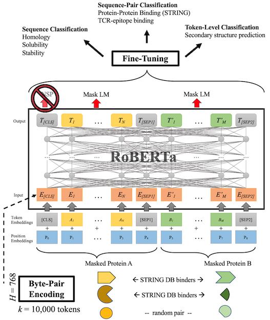

# Paccmann Proteomics

PaccMann Protein Language Modeling for: Protein Classification, Protein-Protein Binding and Protein Sequence Annotation Tasks.

Life science practitioners are drowning in unlabeled protein sequences. Natural Language Processing (NLP) community has recently embraced self-supervised learning as a powerful approach to learn representations from unlabeled text, in large part due to the attention-based context-aware Transformer models. In a transfer learning fashion, expensive pre-trained universal embeddings can be rapidly fine-tuned to multiple downstream prediction tasks.

In this work we present a modification to the RoBERTa model by inputting a mixture of binding and non-binding protein sequences (from STRING database) during pre-training with the Masked Language Modeling (MLM) objective.

Next, we compress protein sequences by 64% with a Byte Pair Encoding (BPE) vocabulary consisting of 10K tokens, each 3-4 amino acids long.

Finally, to expand the model input space to even larger proteins and multi-protein assemblies, we pre-train Longformer models that support 2,048 tokens.

Our approach produces excellent fine-tuning results for protein-protein binding prediction, TCR-epitope binding prediction, cellular-localization and remote homology classification tasks. We suggest that the Transformer's attention mechanism contributes to protein binding site discovery.

## Installation

Use conda:

```console
conda env create -f conda.yml
```

Activate the environment:

```console
conda activate paccmann_proteomics
```

You are good to go and `paccmann_proteomics` is installed in editable mode for development:

```python
import paccmann_proteomics
```

## Model Architecture



An examplary RoBERTa architecture is pre-trained by a mixture of binding and non-binding protein sequences, using only the MLM objective. Byte-pair encoding with a 10k token vocabulary enables inputting 64% longer protein sequences compared to character level embedding. `E_i` and `T_i` represent input and contextual embeddings for token `i`. `[CLS]` is a special token for classification-task output, while `[SEP]` separates two non-consecutive sequences.

## Training Scripts
Scripts for model training and evaluation described in the pre-print can be found [here](./scripts).
Related configuration files can be found [here](./training_configs).

### Launch language modeling pretraining script with a bash command from `scripts` directory:
`bash run_language_modeling_script.sh` (might need to adjust paths to your data and already pre-trained model checkpoints, if necessary)

### Launch sequence level finetuning task with:
`bash run_seq_clf_script.sh`

### Launch token level classification/annotation finetuning task with:
`bash run_token_clf_script.sh`

## Pre-trained models and Data
Pre-trained models and prepared datasets are available at: https://ibm.ent.box.com/v/paccmann-proteomics-data, see `data/pretraining` and `data/fine_tuning` for model pre-training datasets (SwissProt, Pfam, STRING) and the data for model fine-tuning tasks (localization, solubility, PPI, etc). Trained Byte Pair Encoding tokenizers available at `data/tokenization`

Contact [us](mailto:mfilipav@gmail.com,drugilsberg@gmail.com,joriscadow@gmail.com) if you have further questions :smiley:.

## Preprint
Our preprint was accepted to Machine Learning for Structural Biology (MLSB) workshop at NeurIPS 2020, and [can be found here](paper/filipavicius_2020_neurips_mlsb.pdf).
